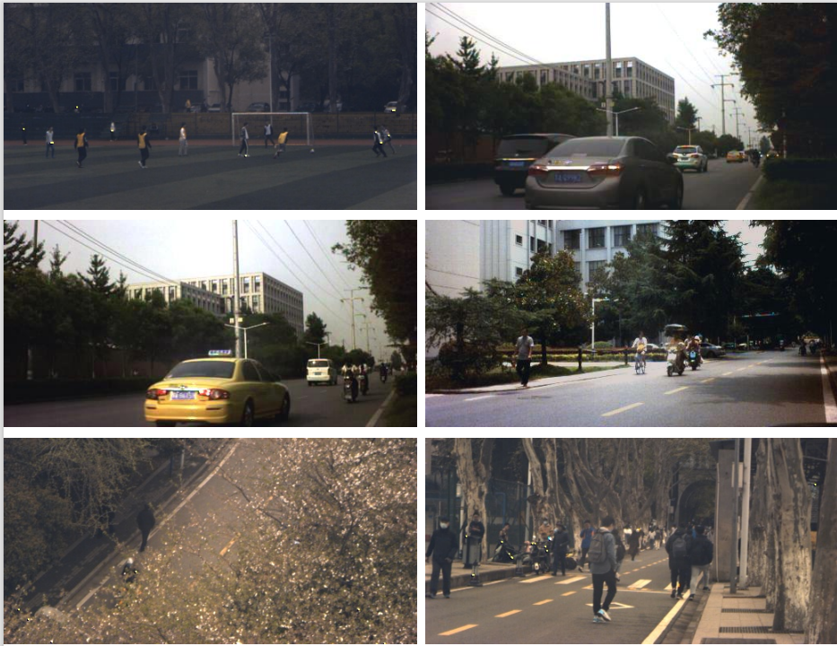
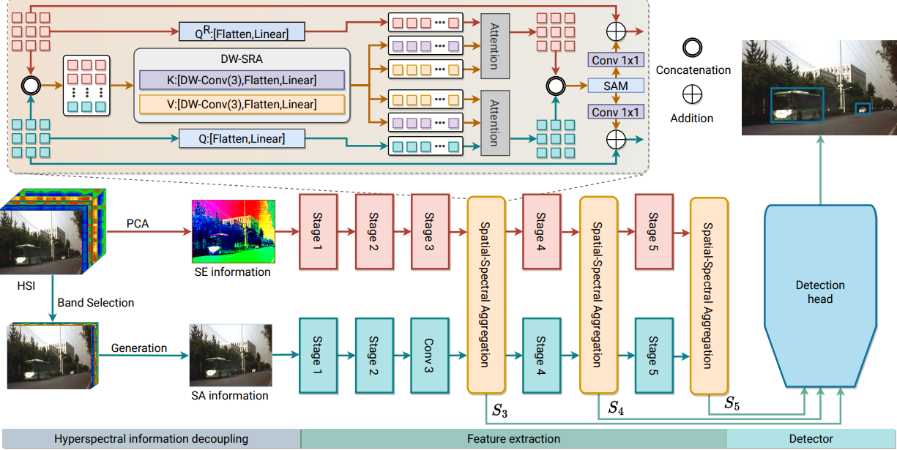
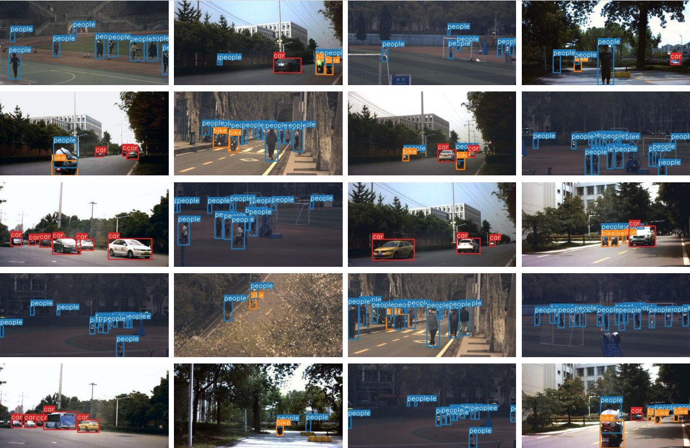

# Object Detection in Hyperspectral Image via Unified Spectral-Spatial Feature Aggregation

This repo is the official implementation for **Object Detection in Hyperspectral Image via Unified Spectral-Spatial Feature Aggregation**. The paper has been accepted to **TGRS 2023**.

### News
[2023.08.28] **Code** and **Dataset** released!

[2023.08.18] Our paper is ready!

## Introduction

**Abstract.** Deep learning-based hyperspectral image (HSI) classification and object detection techniques have gained significant attention due to their vital role in image content analysis, interpretation, and broader HSI applications. However, current hyperspectral object detection approaches predominantly emphasize spectral or spatial information, overlooking the valuable complementary relationship between these two aspects. In this study, we present a novel Spectral-Spatial Aggregation (S2ADet) object detector that effectively harnesses the rich spectral and spatial complementary information inherent in the hyperspectral image. S2ADet comprises a hyperspectral information decoupling (HID) module, a two-stream feature extraction network, and a one-stage detection head. The HID module processes hyperspectral data by aggregating spectral and spatial information via band selection and principal components analysis, consequently reducing redundancy. Based on the acquired spectral and spatial aggregation information, we propose a feature aggregation two-stream network for interacting spectral-spatial features. Furthermore, to address the limitations of existing databases, we annotate an extensive dataset, designated as HOD3K, containing 3,242 hyperspectral images captured across diverse real-world scenes and encompassing three object classes. These images possess a resolution of 512$\times$256 pixels and cover 16 bands ranging from 470 nm to 620 nm. Comprehensive experiments on two datasets demonstrate that S2ADet surpasses existing state-of-the-art methods, achieving robust and reliable results.


## Installation 
Python>=3.6.0 is required with all requirements.txt installed including PyTorch>=1.7 (The same as yolov5 https://github.com/ultralytics/yolov5 ).

  
#### Install requirements
 ```bash
$ pip install -r requirements.txt
```

# HSI-Object-Detection

We provide processed spectral aggregation information and spatial aggregation information in the data set.

If you were to reprocess hyperspectral data, the original hyperspectral data needs to be processed before they can use, reference: https://www.hsitracking.com/.

## Dataset
### HOD3K


Contains the raw hyperspectral train:

-[HOD3K]  [download](https://pan.baidu.com/s/16ofE5ljzvNCFU_NO43xE6Q) password:gvbe

Contains the processed hyperspectral dataset and the raw hyperspectral val and test dataset:

-[HOD3K]  [download](https://pan.baidu.com/s/1ga-YqLqTqVxTbnHHjch82g) password:qugy


We used [hsitracking](https://www.hsitracking.com) provided for annotation. Their work (Material based object tracking in hyperspectral videos) was published in IEEE TIP, many thanks for their awesome work.


### HSI-1
[download](https://github.com/yanlongbinluck/HSI-Object-Detection-NPU)

Contains the processed HSI-1 dataset:

-[HSI-1]  [download](https://pan.baidu.com/s/1BuR9FCkoZEj1Czd4XVFKAA) password:my1z


### Lable

In the HSI-1 dataset, you need to convert all annotations to YOLOv5 format.

Refer: https://github.com/ultralytics/yolov5/wiki/Train-Custom-Data

### Visualization of HOD3K Dataset
 
<div align="left">

</div>

## Run

#### Download the pretrained weights of S2ANet

Soon coming

#### Download the pretrained weights

yolov5 weights (pre-train) 

-[yolov5s] [google drive](https://drive.google.com/file/d/1UGAsaOvV7jVrk0RvFVYL6Vq0K7NQLD8H/view?usp=sharing)

-[yolov5m] [google drive](https://drive.google.com/file/d/1qB7L2vtlGppGjHp5xpXCKw14YHhbV4s1/view?usp=sharing)

-[yolov5l] [google drive](https://drive.google.com/file/d/12OFGLF73CqTgOCMJAycZ8lB4eW19D0nb/view?usp=sharing)

-[yolov5x] [google drive](https://drive.google.com/file/d/1e9xiQImx84KFQ_a7XXpn608I3rhRmKEn/view?usp=sharing)


### Train Test and Detect
train: ``` python train.py```

test: ``` python test.py```

detect: ``` python detect_twostream.py```

### S2ADet Overview
<div align="left">

</div>

### Visualization of Detection

<div align="left">

</div>

## Acknowledgment

Our codes are mainly based on [yolov5](https://github.com/ultralytics/yolov5) and [DocF](https://github.com/DocF/multispectral-object-detection). Many thanks to the authors!


## Citation

If this is useful for your research, please consider cite.

```
@article{xiong2020material,
  title={Material based object tracking in hyperspectral videos},
  author={Xiong, Fengchao and Zhou, Jun and Qian, Yuntao},
  journal={IEEE Transactions on Image Processing},
  volume={29},
  pages={3719--3733},
  year={2020},
  publisher={IEEE}
}

@article{he2023object,
  title={Object Detection in Hyperspectral Image via Unified Spectral-Spatial Feature Aggregation},
  author={He, Xiao and Tang, Chang and Liu, Xinwang and Zhang, Wei and Sun, Kun and Xu, Jiangfeng},
  journal={arXiv preprint arXiv:2306.08370},
  year={2023}
}

```


# 复现
1. 下载与安装
   + 进入合适工作目录：`cd /path/to/my/work-dir`
   + 下载项目：`git clone https://github.com/hexiao0275/S2ADet`
   + 下载yolo-v5：`cd S2ADet && git clone https://github.com/ultralytics/yolov5.git`
   + 准备环境：
    ```bash
    # 1.事先进入目标 python 环境，略
    # 2.安装 S2ADet 依赖
    pip install -r S2ADet/requirements.txt
    # 3.安装 YOLO-v5 依赖
    # 先注释 yolov5/requirements.txt中关于 pytorch 的依赖：`torch torchvision`
    pip install -r yolov5/requirements.txt
    # 4.单独安装GPU版 pytorch，yolo默认为CPU版
    pip install torch torchvision --index-url https://download.pytorch.org/whl/cu124
    # 5.安装wandb
    pip install wandb
   ```
    + 下载预训练模型：全部放入 `S2ADet/yolo_weight` 文件夹
      + [yolo-v5s](https://drive.google.com/file/d/1UGAsaOvV7jVrk0RvFVYL6Vq0K7NQLD8H/view?usp=sharing)
      + [yolo-v5m](https://drive.google.com/file/d/1qB7L2vtlGppGjHp5xpXCKw14YHhbV4s1/view?usp=sharing)
      + [yolo-v5l](https://drive.google.com/file/d/12OFGLF73CqTgOCMJAycZ8lB4eW19D0nb/view?usp=sharing)
      + [yolo-v5x](https://drive.google.com/file/d/1e9xiQImx84KFQ_a7XXpn608I3rhRmKEn/view?usp=sharing)
    + 下载数据集，全部放入 `S2ADet/Dataset`，完成之后一定要先删除 `*.cache` 文件，其中缓存的是绝对路径，文件目录：
      + hod_1
        + ir
          + images
            + test
            + train
            + trainval
            + val
          + labels
            + test
            + train
            + trainval
            + val
            + test.cache
        + rgb
          + images
            + test
            + train
            + trainval
            + val
          + labels
            + test
            + train
            + trainval
            + val
            + test.cache
      + hsi_dataset
        + HSI
          + test
          + val
        + hsidetection
          + sa_information
            + images
              + test
              + train
              + val
            + labels
              + test
              + train
              + val
              + test.cache
              + train.cache
          + se_information
            + images
              + test
              + train
              + val
            + labels
              + test
              + train
              + val
              + test.cache
              + train.cache
      + raw_hsi_train
        + ...
2. 修改文件
    + 修改 `yaml` 配置文件：将 `S2ADet/data/hsi` 文件夹下的所有 `yaml` 文件中的路径替换为自己电脑的路径，源文件为绝对路径
    + 修改 `train.py`、`test.py`、`detect_twostream.py`文件中 `arguments` 里关于路径的默认值，源文件为绝对路径
3. wandb：
    + 注册前往 [wandb官网](https://wandb.ai) 注册账号
    + 访问 [授权码页面](https://wandb.ai/authorize) 获取授权码
    + 本地登录wandb：`wandb login`，之后输入授权码即可实现登录
4. 启动训练
   ```bash
    # 1.训练
    python train.py --epochs 20 --batch-size 8
    # 2.测试
    python test.py
    # 3.推理
    python detect_twostream.py
    ```

